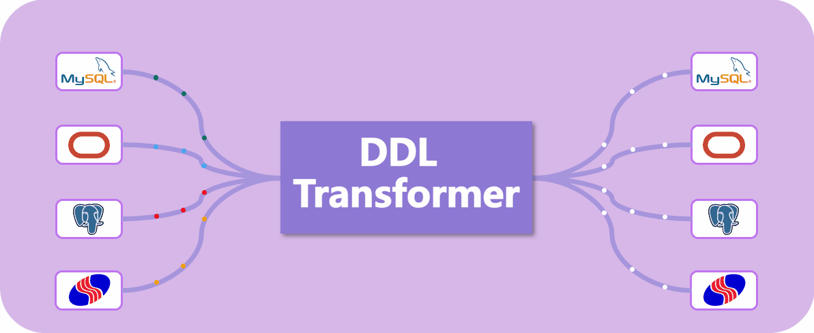
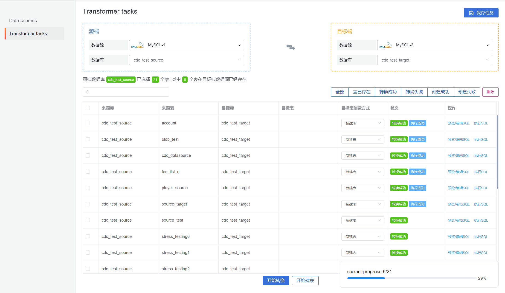
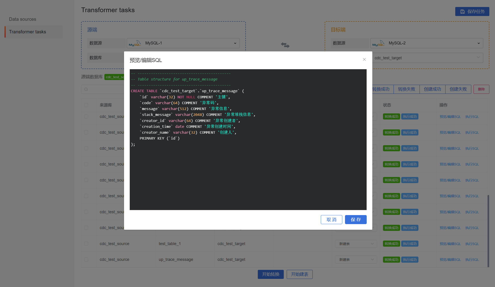
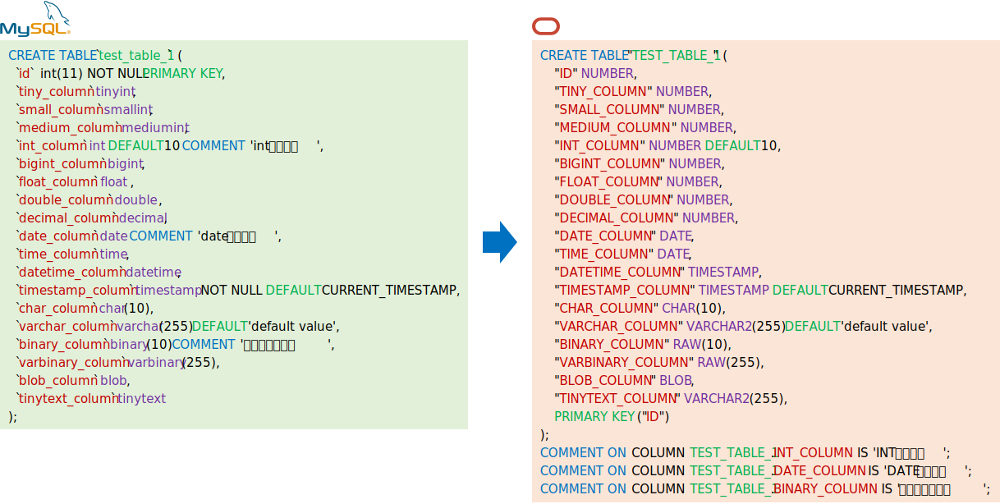
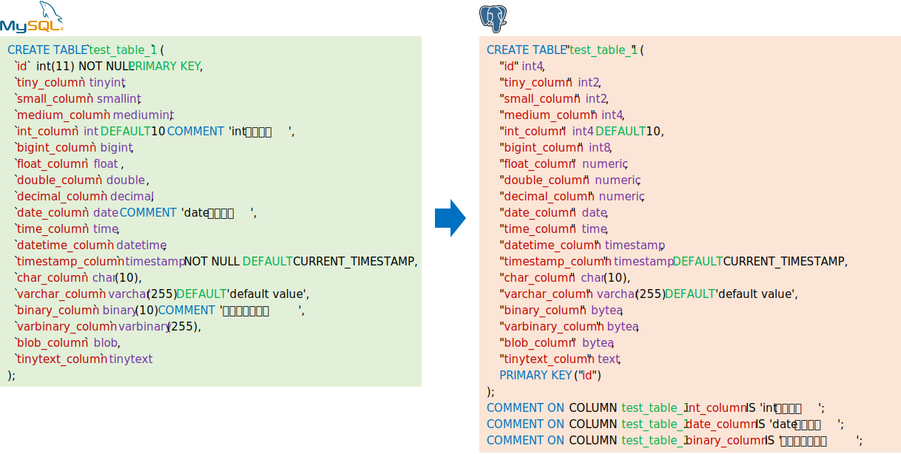
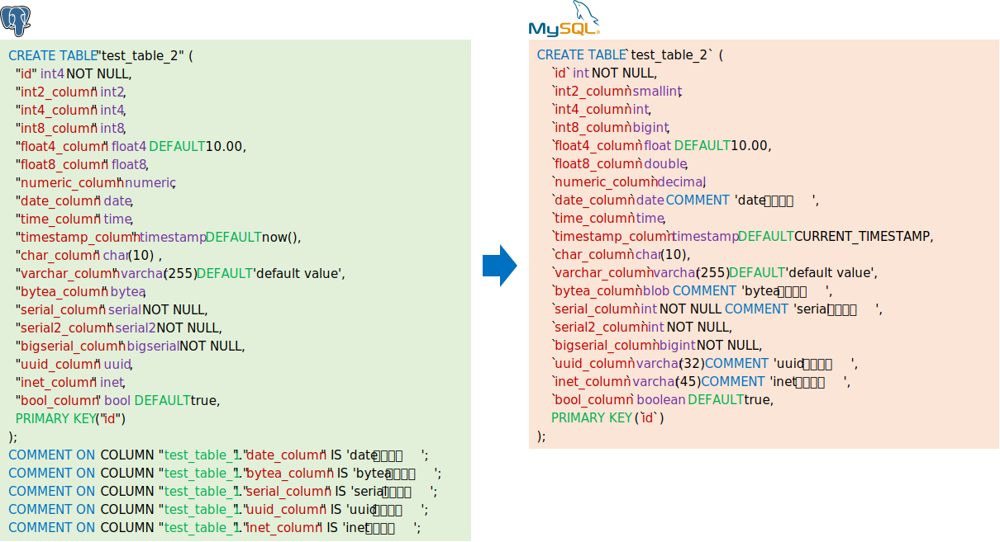

# Database DDL transformer

## Features

- Currently, it supports DDL conversion among `MySQL`, `Oracle`, `PostgreSQL`, and `Dameng` databases. Of course, conversion between databases of the same type is also supported.
- It supports mapping of most data types.
- It supports DDL features such as `column comment`, `default value`, and `default function`.
- It supports index synchronization.
- It is easy to extend.

## Running Captures

## Comparison of conversion results

`MySQL` to `Oracle`:

`MySQL` 到 `PostgreSQL` 

`PostgreSQL` 到 `MySQL` ：

